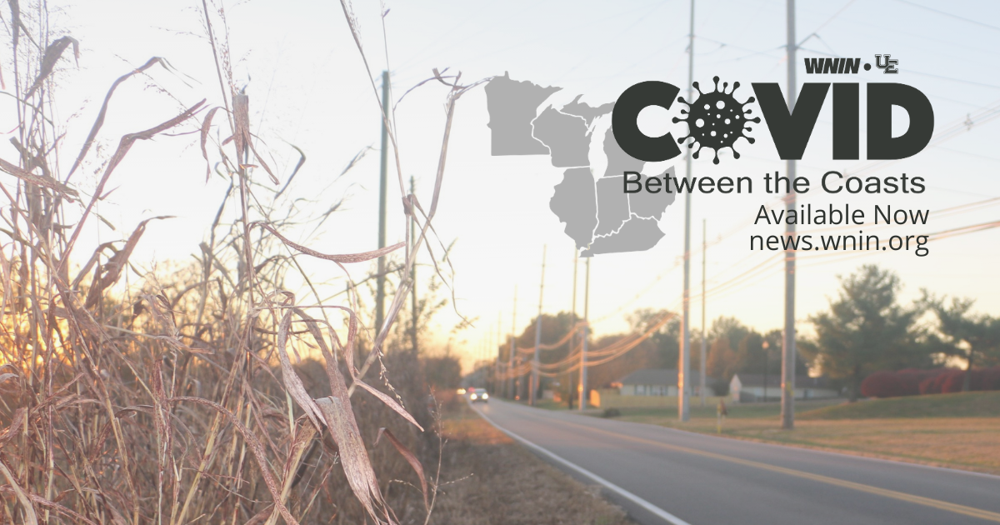

# COVID Between the Coasts

  

This repo contains the work and analysis done to provide the data foundation to the reporting done by WNIN, an NPR/PBS affiliate located in Evansville, Indiana. The work was a collaborative project between the University of Evansville and WNIN and culminated in an award-winning investigative podcast series dedicated to telling the story of COVID in the midwest from the midwestern perspective. It involved the work of WNIN, &iquest;Qu&eacute; Pasa, Midwest?, and two ChangeLab classes at the University of Evansville (one in communications and the other in data science)

This repo contains the work done by the data science class at the University of Evansville, consisting of undergraduate students in the Statistics and Data Science program. The work contains the initial analysis conducted that incorporated demographic information from the U.S. Census Bureau and COVID-19 statistics to assess the impact of COVID across the midwest region and how it could be disporportionately affecting people based on several demographic characteristics. In addition, an interactive, constantly updating web app was created to allow the public to explore and see how COVID spread across the midwest. It also includes the ability to compare any two counties in the seven state region. Lastly, a Twitter script was developed to tweet out daily the new case numbers for all seven states (Illinois, Indiana, Iowa, Ohio, Michigan, Minnesota, and Wisconsin). 

The stories can be found at on [WNIN's website](https://news.wnin.org/covid-between-the-coasts), as can the interactive app.

## Awards

* Edward R. Murrow Award (Excellence in Innovation)
* Regional Edward R. Murrow Award (Excellence in Writing)
* Regional Edward R. Murrow Award (Sports Reporting)
* Indiana Professional Chapter of the Society of Professional Journalists "Best of Indiana"
* Leadership Everyone's COVID-19 Community Award
